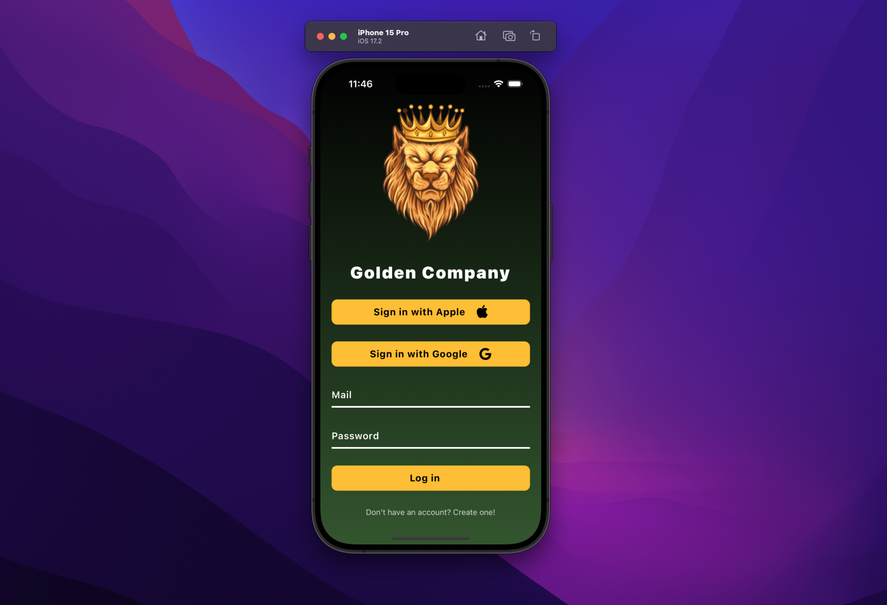

# React Native Mobile Login Screen

This project showcases an elegant login screen design for a mobile application developed using React Native. The project is crafted using popular libraries such as `react-native-linear-gradient` and `react-native-vector-icons`.

## Features

- A visually appealing login screen
- Smooth gradient transition effect using `linear-gradient`
- Usage of `vector-icons` for icons
- Easy installation and customization

## Installation

Clone the project to your local machine and follow the steps below to install dependencies:

```bash
git clone https://github.com/your-username/react-native-login-screen.git
cd react-native-login-screen
npm install


# Using React Native CLI
npx react-native run-android

# or

npx react-native run-ios

```


